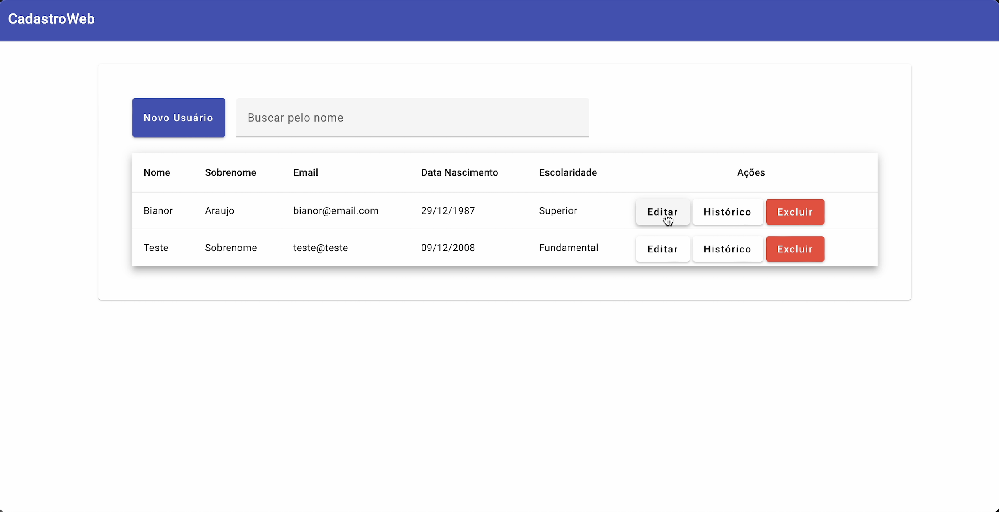
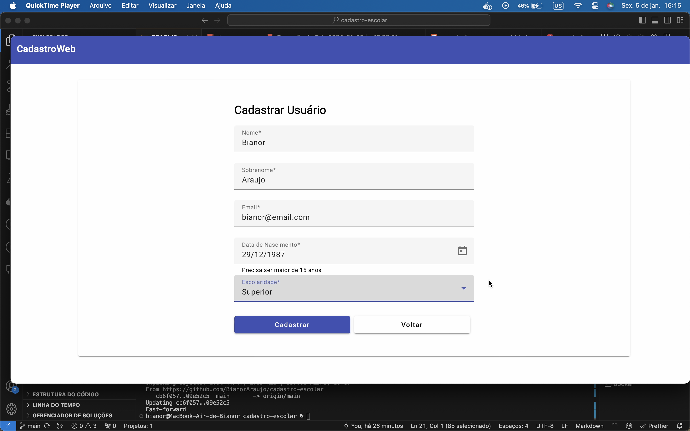
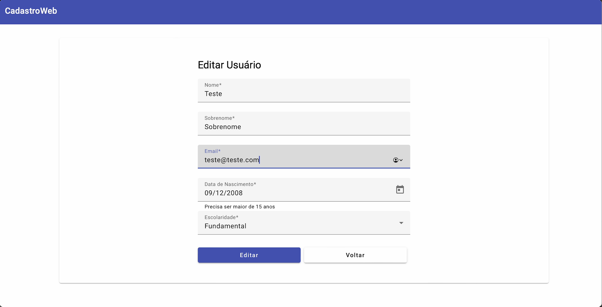
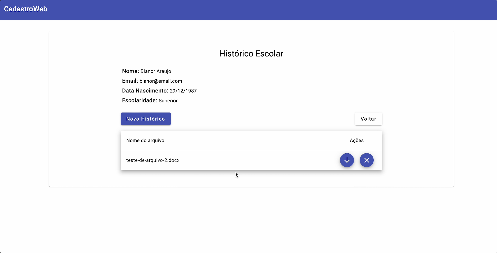

# cadastro-escolar
Aplicação para cadastro de usuários e seus hitóricos escolares.
Desenvolvida para validação técnica.


## Tecnologias

* Angular JS 16
* Angular Material
* .NET 6.0
* Dapper
* SQL Server
* Docker


## Como iniciar

Para iniciar o projeto você precisa ter instalado o Docker CLI ou Docker Desktop [https://www.docker.com](https://www.docker.com)

Clone o repositório e entre no diretório onde foi clonado.

Execute o seguinte comando:
```
docker-compose -f compose.yaml up --build -d
```

Acessar pelo link
```
http://localhost:4200
```


## Imagens

### Home

<div align="center">
  
</div>


### Cadastrar

<div align="center">
  
</div>


### Editar

<div align="center">
  
</div>


### Histórico

<div align="center">
  
</div>
